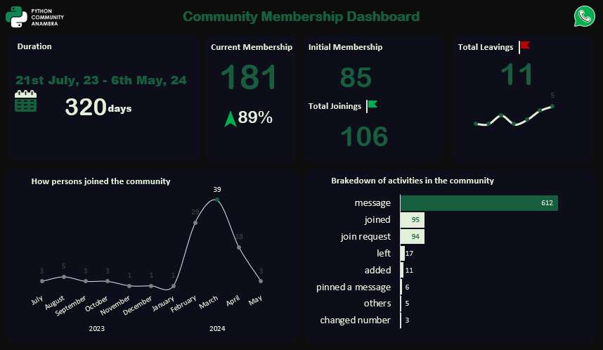
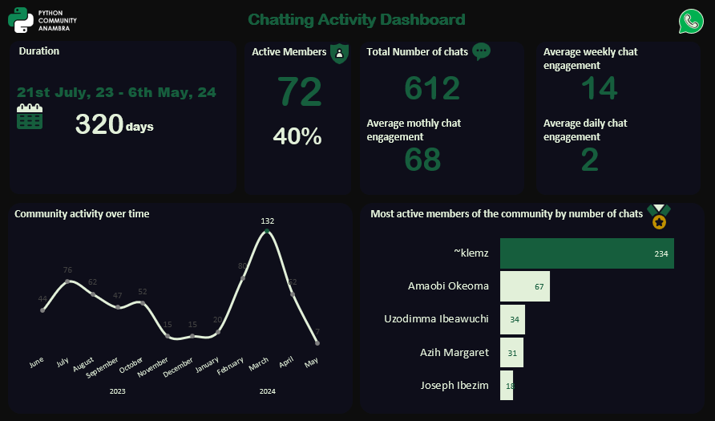
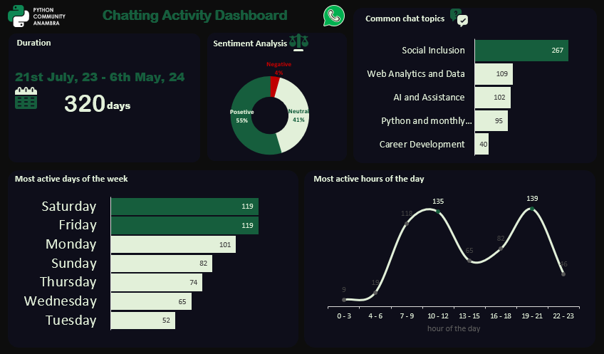

# 
 Introduction

## 
About the dataset

The dataset for this project was obtaind by exporting chat from Python Community Anambra whatsapp general group. The data exported is a text file that contains activities on the group from between 21st July, 2023 to 6th May, 2024.

## 
Objectives of the project

1. Determine how active the group members are in engaging the platform
2. Understand the flow of persons into and out of the group
3. Discover trends in activity rate
4. Uncover some patterns in how persons use the platform
5. Build dashboards to represent these findings.

## 
Duration of project

This project was projected to take at most three days so it started on the 7th May 2024 but was concluded on 12th May 2024, a little longer than the projected duration due to some technical challanges.

## 
Tools Used

In the course of completing this project, I used Microsoft Excel, Power Query, and python(jupyter notebook) libraries including pandas, seaborn, matplotlib, nltk, gensim and re.

## 
 Analysis Activities

1. I exported the data from the whatsapp platform
2. ETL(Extract,Transform, Load) with python into jupyter notebook with re and pandas
3. Data cleaning and transformations with pandas
4. EDA(Exploratory Data Analysis) with pandas, matplotlib and seaborn
5. Export of some partialy cleaned data as csv for further processing with Microsoft power query and Excel.
6. Data cleaning and transformation with Microsoft Power Query
7. Data Analysis with Microsoft Excel's pivot table, formulas and functions
8. Data Visualization with Microsoft Excel's charts
9. Text analysis in jupyter notebook using nltk amd gensim
10. Export of all relevant data as csv for use in Excel
11. Dashboard Building

**The project analysis is found in "chat_analysis.ipynb**"

## 
Challanges

1. Initially extracting the data from the text file using regex was a hard one but it was overcomed by research and practice
2. Topic modeling and the preprocessing of text was not easy becaus i dont often do text analysis so the tools are not very familiar

## 
Conclussions

- The conclussions of this project are summarized in these accompaning dashboard report produced using Microsoft Excel.
- 
- 
- 
